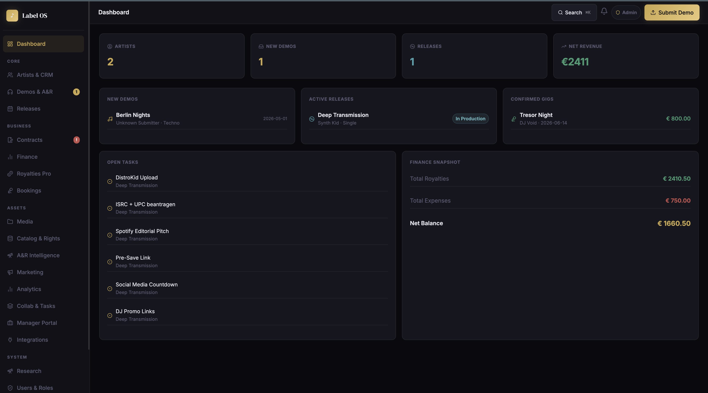

# 🎵 labelmanager

> **The all-in-one operating system for independent record labels.**  
> Manage artists, A&R pipelines, releases, royalties, bookings, media and your entire team — in one dark, fast, single-file web app.




---

## 📖 Documentation & User Manual

**[👉 Click here to read the complete User Manual](docs/index.html)**

The documentation includes detailed step-by-step guides on setting up your label, managing the A&R pipeline, calculating royalties, using the Artist/Manager portals, and configuring integrations.

---

## ✨ Overview

labelmanager is a feature-complete, **single-file progressive web app** built for independent labels, A&R managers, booking agents and music producers. No backend required — everything runs in the browser using localStorage with a clean, dark-mode UI inspired by modern SaaS tools.

It was designed to replace the fragmented label workflow of juggling Notion, Google Sheets, Dropbox, email chains and spreadsheets — and replace them with one coherent system.

---

## 🚀 Features at a Glance

| Module | Highlights |
|---|---|
| **Artists & CRM** | Profiles, social links, territories, genres, contract info, relationship graph |
| **Contacts** | Managers, bookers, PR, labels, distributors, blogs, radio — typed & searchable |
| **Demos & A&R** | Kanban pipeline, audio waveform preview, star ratings, watchlist, comments |
| **Submission Form** | Public-facing demo submission page with file upload & auto-confirmation |
| **Releases** | Full timeline, status chain, smart task templates, campaign layer |
| **Royalties Pro** | Multi-contract engine, CSV import, split calculation, statements, payouts |
| **Catalog** | Track entity (ISRC, credits, rights), release packager, metadata QC |
| **Bookings & Events** | Gig pipeline, venue/promoter, riders, settlement, calendar export (ICS) |
| **Finance** | Income/expenses, recoupment tracking, payout history, balance overview |
| **Media Library** | Upload, tagging, waveform player with markers, version management |
| **A&R Intelligence** | Scoring engine, funnel analytics, remix contests, watchlist grid |
| **Marketing** | Smart links, pre-save pages, promo pool, EPK generator, campaign board |
| **Analytics** | Release performance, A&R funnel, channel analytics, team productivity |
| **Collaboration** | Global task board (drag-drop Kanban), notes with @mentions, automations |
| **Artist Portal** | Artist-facing dashboard: releases, demos, financials, statements, assets |
| **Manager Portal** | Read-only view for managers & agencies: roster, gigs, releases, pitches |
| **Integrations** | Webhooks (Slack/Discord), platform import (LabelRadar, SubmitHub), distributor export (DistroKid, FUGA, Bandcamp) |
| **Notifications** | In-app bell, badge counter, event queue, mark-all-read |
| **RBAC** | 4 roles: Admin, Label Manager, A&R, Artist — module & record-level |

---

## 📸 Screenshots

> _Add your screenshots to `/docs/` and update these paths._

| Dashboard | A&R Kanban | Royalties |
|---|---|---|
|  |  |  |

| Artist Portal | Integrations | Media Library |
|---|---|---|
|  |  |  |

---

## 🏗️ Architecture

labelmanager is intentionally built as a **zero-dependency, single-file app** for maximum portability and zero DevOps overhead. All data lives in `localStorage` and can be exported/imported as JSON at any time.

```
labelmanager/
├── index.html          ← Entire app (HTML + CSS + JS in one file)
├── assets/
│   ├── js/
│   │   └── script.js   ← App logic (LOS object, ~3500+ lines)
│   ├── css/
│   │   └── style.css   ← Design system, dark theme, component library
│   └── fonts/          ← Optional: local font files
├── docs/               ← User Manual and Screenshots
│   └── index.html      ← Documentation Entry Point
├── README.md
└── LICENSE
```

### Data Model

All entities are stored as JSON arrays in `localStorage` under the key `labelmanager_db`:

```
users          → RBAC, roles, linked artist_id
artists        → Core roster entity
contacts       → All external relationships
demos          → Submissions, A&R pipeline
releases       → Full release lifecycle
tracks         → Per-track metadata, ISRC, credits
events         → Gigs, bookings, settlements
royalties      → Income per release/territory/source
royalty_contracts → Splits, advances, recoupment
royalty_statements → Period statements per artist
payouts        → Actual payments made
expenses       → Label costs, recoupable items
media          → Asset library entries
smart_links    → Pre-save / DSP routing links
promo_links    → Timed promo access links
global_tasks   → Cross-module task board
notes          → Entity-linked internal notes
automations    → Trigger → action rules
webhooks       → Outgoing webhook configs
integration_logs → Audit trail for integrations
notifications  → In-app notification queue
```

---

## ⚡ Quick Start

### Option A — Just open it

```bash
git clone https://github.com/gemichelst/labelmanager.git
cd labelmanager
open index.html
```

No build step. No npm install. No server needed.

### Option B — Serve locally (recommended for file uploads)

```bash
# Python
python3 -m http.server 8080

# Node
npx serve .

# VS Code
# → Install "Live Server" extension → Right-click index.html → Open with Live Server
```

Then open [http://localhost:8080](http://localhost:8080).

### Default login

| Email | Password | Role |
|---|---|---|
| `admin@labelmanager.app` | `admin1234` | Admin |
| `ar@labelmanager.app` | `ar1234` | A&R |
| `artist@labelmanager.app` | `artist1234` | Artist |

> ⚠️ Change credentials in Settings → Users before sharing with your team.

---

## 📦 Dependencies (CDN)

All loaded via CDN — no `npm install` required:

```html
<!-- In <head>, before your script.js -->
<script src="https://cdn.jsdelivr.net/npm/chart.js@4.4.3/dist/chart.umd.min.js"></script>
<script src="https://unpkg.com/lucide@latest/dist/umd/lucide.min.js"></script>
<script src="https://unpkg.com/wavesurfer.js@7/dist/wavesurfer.min.js"></script>
```

| Library | Purpose | Version |
|---|---|---|
| [Chart.js](https://www.chartjs.org/) | Analytics charts | 4.4.3 |
| [Lucide Icons](https://lucide.dev/) | Icon system | latest |
| [WaveSurfer.js](https://wavesurfer.xyz/) | Audio waveform player | 7.x |

> **Important:** CDN scripts must load **before** `script.js`. Chart.js especially must be present before `init()` runs.

---

## 🎛️ Configuration

### Roles & Permissions

Edit the `ROLES` constant at the top of `script.js`:

```js
const ROLES = {
  admin:        { label: 'Admin',         modules: '*' },
  label_manager:{ label: 'Label Manager', modules: ['crm','anr','releases','finance','media','royalties','events','integrations'] },
  ar:           { label: 'A&R',           modules: ['crm','anr','releases','media'] },
  artist:       { label: 'Artist',        modules: ['artist-portal'] },
};
```

### Seed Data

The default seed populates artists, demos, releases and finance entries for demo purposes. To start fresh:

1. Open the app
2. Go to **Settings → Database**
3. Click **"Reset to Empty"**

Or manually in the browser console:

```js
localStorage.removeItem('labelmanager_db');
location.reload();
```

### Label Identity

Set your label name, logo URL and primary colour in **Settings → Label Profile**.  
Or directly in `script.js`:

```js
const LABEL_CONFIG = {
  name:    'Your Label Name',
  color:   '#c9a84c',   // gold accent
  country: 'DE',
  currency:'EUR',
};
```

---

## 🔔 Notifications

The in-app notification system fires automatically on key events. To push a custom notification from anywhere in the code:

```js
LOS.pushNotification(
  'demo_new',                          // type: demo_new | release | payout | gig | contract | task_due
  'New demo submitted: "Track Title"', // message string
  'anr'                                // target view (data-view attribute of nav item)
);
```

---

## 🔗 Webhooks & Integrations

### Outgoing Webhooks (Slack / Discord / Make / Zapier)

1. Go to **Integrations → Webhooks → New Webhook**
2. Paste your Slack/Discord incoming webhook URL
3. Select trigger events: `demo.new`, `release.created`, `gig.confirmed`, `payout.created`, `contract.expiring`
4. Use **Test Webhook** to preview the JSON payload

> In the local/file:// version, webhooks are simulated (payload shown, no real HTTP). Deploy to a server or use the React/Node version for live delivery.

### Demo Platform Import (LabelRadar, SubmitHub, Soundplate)

1. Export a CSV from your demo platform
2. Go to **Integrations → Platform Import**
3. Select the platform for correct column mapping
4. Drop the CSV — preview auto-generates
5. Click **Import Demos** → submissions land directly in your A&R Kanban

### Distributor Export

Generate a release delivery package for:

| Distributor | Format |
|---|---|
| DistroKid | CSV |
| FUGA | XML (ERN 4.x) |
| Believe Digital | XML |
| The Orchard | TSV |
| Bandcamp | JSON |
| Generic | CSV |

Go to **Integrations → Distributor Export**, select a release and click **Generate Export**, then download.

---

## 🎭 Portals

### Artist Portal (`/view-artist-portal`)

Artists log in and see only their own data:
- Release overview with royalty share per release
- Demo submission history with A&R status
- Financial summary: gross royalties, their split %, balance due
- Downloadable statements
- Approved media assets

### Manager Portal (`/view-manager-portal`)

Read-only view for managers and booking agencies:
- Full roster overview with gig counts
- Upcoming confirmed gigs with fees
- Release pipeline with task completion progress
- Active A&R pitches and their status

---

## 📊 A&R Pipeline

The demo pipeline uses a 7-stage Kanban board:

```
New → Reviewed → Shortlist → In Talk → Offer → Signed ✓ → Rejected
```

Each card shows:
- Waveform audio preview (WaveSurfer.js)
- Star rating (1–5, persisted per demo)
- Genre, BPM, key metadata
- Quick-move status dropdown
- Internal comments thread

### A&R Scoring Engine

Demos are auto-scored based on:
- Internal star rating (40%)
- Artist history on the label (20%)
- Pipeline stage duration (20%)
- External signals: social, platform links (20%)

---

## 🏷️ Release Lifecycle

```
Idea → A&R Selected → In Production → Mastered → Distributor Setup
     → Pre-Save → Scheduled → Released → Post-Campaign
```

Smart task templates auto-generate a backwards timeline from the release date. Template types:

- `streaming-single` — Editorial pitch, Spotify/Apple setup, social assets
- `club-ep` — DJ promo, Beatport setup, press kit
- `vinyl` — Plant booking, artwork print specs, distribution
- `compilation` — Multi-artist clearances, ISRC block

---

## 💾 Data Export & Backup

### Full JSON export

```js
// In browser console:
const data = localStorage.getItem('labelmanager_db');
const blob = new Blob([data], { type: 'application/json' });
const a = document.createElement('a');
a.href = URL.createObjectURL(blob);
a.download = 'labelmanager-backup.json';
a.click();
```

Or use **Settings → Database → Export JSON**.

### Import / Restore

Drag a previously exported `.json` file onto **Settings → Database → Import**, or:

```js
// Restore from file:
const json = await file.text();
localStorage.setItem('labelmanager_db', json);
location.reload();
```

---

## 🚀 Deployment

### Vercel (recommended)

```bash
npx vercel
# → Set output directory to . (root)
# → No build command needed
```

[](https://vercel.com/new)

### Netlify

```bash
npx netlify deploy --dir=. --prod
```

[](https://app.netlify.com/start)

### GitHub Pages

```bash
# In repo Settings → Pages → Source: Deploy from branch → main → / (root)
```

Your app will be live at `https://gemichelst.github.io/labelmanager/`

### Docker (optional, for team hosting)

```dockerfile
FROM nginx:alpine
COPY . /usr/share/nginx/html
EXPOSE 80
CMD ["nginx", "-g", "daemon off;"]
```

```bash
docker build -t labelmanager .
docker run -p 8080:80 labelmanager
```

---

## 🐛 Known Issues & Fixes

| Issue | Fix |
|---|---|
| `Chart is not defined` | Ensure Chart.js CDN loads **before** `script.js` in `<head>` |
| `this.navigate is not a function` | Replace all `this.navigate(x)` with `this._goTo(x)` |
| Notification bell does nothing | Add `e.stopPropagation()` to `toggleNotifPanel(e)` and call `this.initNotifications()` in `init()` |
| Charts render in collapsed panels | Use `el.offsetParent !== null` check before drawing — not `el.style.display` |
| Audio not loading in file:// mode | Serve via `python3 -m http.server` or VS Code Live Server |

---

## 🤝 Contributing

Pull requests are welcome. For major changes, please open an issue first to discuss what you would like to change.

```bash
# Fork and clone
git clone https://github.com/gemichelst/labelmanager.git

# Create a feature branch
git checkout -b feature/your-feature-name

# Commit with conventional commits
git commit -m "feat: add bulk demo import from SubmitHub"

# Push and open a PR
git push origin feature/your-feature-name
```

### Code Style

- Vanilla JS, no build tools, no TypeScript
- All methods live on the global `LOS` object
- CSS custom properties for all colours (`var(--gold)`, `var(--teal)`, etc.)
- Use `lucide.createIcons()` after every dynamic DOM render
- Destroy WaveSurfer instances before recreating (`wsRef?.destroy()`)

---

## 📄 License

MIT — do whatever you want with it. A star ⭐ on GitHub is always appreciated.

---

## 🙏 Acknowledgements

Built with:
- [WaveSurfer.js](https://wavesurfer.xyz/) — audio waveform rendering
- [Chart.js](https://www.chartjs.org/) — analytics visualizations  
- [Lucide Icons](https://lucide.dev/) — icon system
- Inspired by [Reprtoir](https://reprtoir.com/), [LabelRadar](https://labelradar.com/), [Curve Royalties](https://www.curveroyalties.com/), [Bridge.audio](https://bridge.audio/)

---

<p align="center">
  Made with 🖤 for independent labels<br>
  <a href="https://github.com/gemichelst/labelmanager">github.com/gemichelst/labelmanager</a>
</p>
