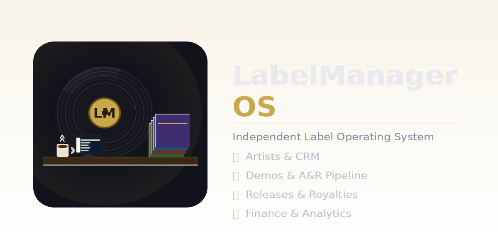

# 🎵 labelmanager



> **The all-in-one operating system for independent record labels.**  
> Manage artists, A&R pipelines, releases, royalties, bookings, media, webhooks, backups, and your entire team — in one dark, fast, single-file web app.


---

## 📖 Documentation & User Manual

**[👉 Click here to read the complete User Manual](docs/index.html)**

The documentation covers setup, A&R, release management, royalties, portals, integrations, backup workflows, and troubleshooting.

---

## ✨ Overview

labelmanager is a feature-complete, **single-file progressive web app** for independent labels, A&R managers, booking agents, artists, and music producers. It runs fully in the browser, stores data locally, and is optimized for fast, offline-friendly usage.

It replaces fragmented label workflows with one coherent system: demos, releases, royalties, finance, media, collaboration, portals, integrations, and backups are handled in one UI.

---

## 🚀 Feature Set

| Module | Highlights |
|---|---|
| **Artists & CRM** | Profiles, social links, territories, genres, contract info, relationship graph |
| **Contacts** | Managers, bookers, PR, labels, distributors, blogs, radio — typed & searchable |
| **Demos & A&R** | Kanban pipeline, audio waveform preview, star ratings, watchlist, comments |
| **Submission Form** | Public-facing demo submission page with file upload & auto-confirmation |
| **Releases** | Full timeline, status chain, smart task templates, campaign layer |
| **Royalties Pro** | Multi-contract engine, CSV import, split calculation, statements, payouts |
| **Catalog** | Track entity (ISRC, credits, rights), release packager, metadata QC |
| **Bookings & Events** | Gig pipeline, venue/promoter, riders, settlement, calendar export (ICS) |
| **Finance** | Income/expenses, recoupment tracking, payout history, balance overview |
| **Media Library** | Upload, tagging, waveform player with markers, version management |
| **A&R Intelligence** | Scoring engine, funnel analytics, remix contests, watchlist grid |
| **Marketing** | Smart links, pre-save pages, promo pool, EPK generator, campaign board |
| **Analytics** | Release performance, A&R funnel, channel analytics, team productivity |
| **Collaboration** | Global task board (drag-drop Kanban), notes with @mentions, automations |
| **Artist Portal** | Artist-facing dashboard: releases, demos, financials, statements, assets |
| **Manager Portal** | Read-only view for managers & agencies: roster, gigs, releases, pitches |
| **Integrations** | Webhooks (Discord, Slack, Make, Zapier), platform import, distributor export, logs |
| **Backup** | Full JSON export/import, restore from file, factory reset, backup statistics |
| **Notifications** | In-app bell, badge counter, event queue, mark-all-read |
| **RBAC** | Roles for Admin, Label Manager, A&R, Artist with module-level access |

---

## 🏗️ Architecture

labelmanager is intentionally built as a **zero-dependency, single-file app** for maximum portability and minimal DevOps overhead. The core app lives in one HTML file plus one bundled JS file and a merged stylesheet.

```
labelmanager/
├── index.html               ← App shell / SPA entry point
├── assets/
│   ├── js/
│   │   ├── auth.js          ← Login/session helpers
│   │   └── index_merged.js  ← Main app logic (LOS object)
│   └── css/
│       └── style_merged.css ← Design system + components
├── manifest.json            ← PWA manifest
├── sw.js                    ← Service worker
├── docs/                    ← User manual and screenshots
├── README.md
└── labelmanager.discordbot.md
```

### Data Model

All entities are stored as JSON in browser localStorage under the app’s database key. Typical collections include:

```
users
artists
contacts
demos
releases
tracks
events
royalties
royalty_contracts
royalty_statements
payouts
expenses
media
smart_links
promo_links
global_tasks
notes
automations
webhooks
integration_logs
notifications
```

---

## ⚡ Quick Start

### Option A — Open locally

```bash
open index.html
```

No build step. No npm install. No backend required.

### Option B — Serve locally

```bash
python3 -m http.server 8080
```

Then open [http://localhost:8080](http://localhost:8080).

Serving over HTTP is recommended for uploads, drag & drop, and service worker support.

---

## 📦 Frontend Dependencies

The app uses CDN-delivered frontend helpers only where needed:

```html
<script src="https://cdn.jsdelivr.net/npm/chart.js@4.4.3/dist/chart.umd.min.js"></script>
<script src="https://unpkg.com/lucide@latest/dist/umd/lucide.min.js"></script>
<script src="https://unpkg.com/wavesurfer.js@7/dist/wavesurfer.min.js"></script>
```

| Library | Purpose |
|---|---|
| Chart.js | Analytics charts |
| Lucide Icons | Icon system |
| WaveSurfer.js | Audio waveform player |

---

## 🎛️ Core Configuration

### Roles & permissions

Access is driven by the app’s role model. Admins can manage everything, while other roles only see selected modules.

### Seed data and reset

The app ships with demo data for artists, demos, releases, media, finance, and integrations. Backup and restore are now part of the main workflow:

- Export the full database as JSON.
- Import a previously exported backup.
- Reset to factory defaults after double confirmation.

### Label identity

Label name, colors, and brand presentation are configurable in the app settings and in the global config used by the UI.

---

## 🔗 Integrations

### Outgoing webhooks

The app supports outgoing webhook definitions for Discord, Slack, Make, Zapier, and any compatible endpoint. Events are emitted from user actions and app workflows.

Typical events include:

- Demo submitted.
- Demo status changed.
- Contract signed.
- Release created.
- Payout created.

### Import / export workflows

The integrations area now includes:

- Webhooks.
- Platform import.
- Distributor export.
- Integration logs.
- Backup and restore.

### Backup area

The backup section exposes the current database size/state and provides:

- Full JSON export.
- JSON import/restore.
- Factory reset.

---

## 🎭 Portals

### Artist Portal

Artists see their own releases, demos, financial summaries, statements, and approved assets.

### Manager Portal

Managers get a read-only overview of rosters, gigs, release status, and pitches.

---

## 📊 A&R and Releases

The A&R pipeline is Kanban-based and optimized for demo screening, notes, ratings, and quick status changes. Releases are managed as a timeline-driven workflow with campaign steps and task templates.

---

## 💾 Backup and Restore

The app now has a dedicated backup section with direct JSON export/import and destructive reset actions. This makes it easy to move data between browsers, preserve snapshots, and recover from mistakes.

The main backup use cases are:

1. Local snapshots before experiments.
2. Restoring the label database on a new device.
3. Sharing data with a connected service or bot.

---

## 🚀 Deployment

The app is static and can be deployed anywhere that serves HTML, CSS, JS, and JSON files.

Recommended targets:

- GitHub Pages.
- Netlify.
- Vercel.
- Any Nginx/Apache/Plesk host.

---

## 🔌 Discord Bot Ready

A companion Discord bot can read app data through exported backups, shared JSON endpoints, or a small bridge service. The repo now includes a dedicated design document for that workflow: **`labelmanager.discordbot.md`**.

---

## 📄 License

MIT — do whatever you want with it. A star on GitHub is always appreciated.
